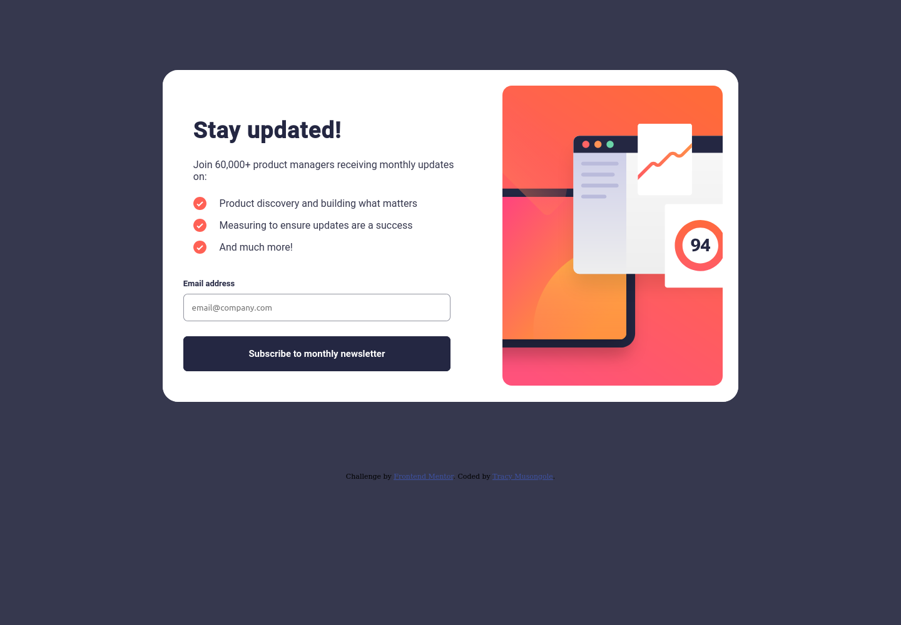

# Frontend Mentor - Newsletter sign-up form with success message solution

This is a solution to the [Newsletter sign-up form with success message challenge on Frontend Mentor](https://www.frontendmentor.io/challenges/newsletter-signup-form-with-success-message-3FC1AZbNrv). Frontend Mentor challenges help you improve your coding skills by building realistic projects. 

## Table of contents

- [Overview](#overview)
  - [The challenge](#the-challenge)
  - [Screenshot](#screenshot)
  - [Links](#links)
- [My process](#my-process)
  - [Built with](#built-with)
  - [What I learned](#what-i-learned)
  - [Continued development](#continued-development)
- [Author](#author)

## Overview

### The challenge

Users should be able to:

- Add their email and submit the form
- See a success message with their email after successfully submitting the form
- See form validation messages if:
  - The field is left empty
  - The email address is not formatted correctly
- View the optimal layout for the interface depending on their device's screen size
- See hover and focus states for all interactive elements on the page

### Screenshot
Mobile


Desktop



### Links

- Solution URL: [Add solution URL here](https://github.com/TracyMuso/Newsletter-signup/)
- Live Site URL: [Add live site URL here](https://tracymuso.github.io/Newsletter-signup/)

## My process
- I started with mobile fisrt development
- I created all the functions for component interactions
then I created a desktop version

### Built with

- Semantic HTML5 markup
- CSS custom properties
- Flexbox
- CSS Grid
- Mobile-first workflow

<!-- ### What I learned

Use this section to recap over some of your major learnings while working through this project. Writing these out and providing code samples of areas you want to highlight is a great way to reinforce your own knowledge.

To see how you can add code snippets, see below:

```html
<h1>Some HTML code I'm proud of</h1>
```
```css
.proud-of-this-css {
  color: papayawhip;
}
```
```js
const proudOfThisFunc = () => {
  console.log('🎉')
}
``` -->

### Continued development

I plan on adding more animations and responsiveness to this project

## Author

- Website - [tracymuso](https://www.tracymuso.com)
- Frontend Mentor - [@TracyMuso](https://www.frontendmentor.io/profile/TracyMuso)
- Linkedin - [@tracy-muso](https://www.linkedin.com/in/tracy-muso)

**Note: Delete this note and add/remove/edit lines above based on what links you'd like to share.**
